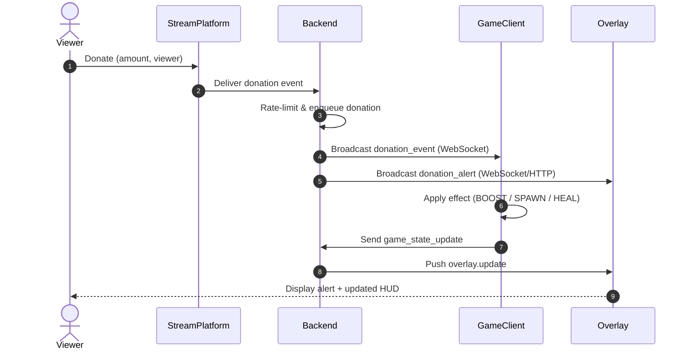
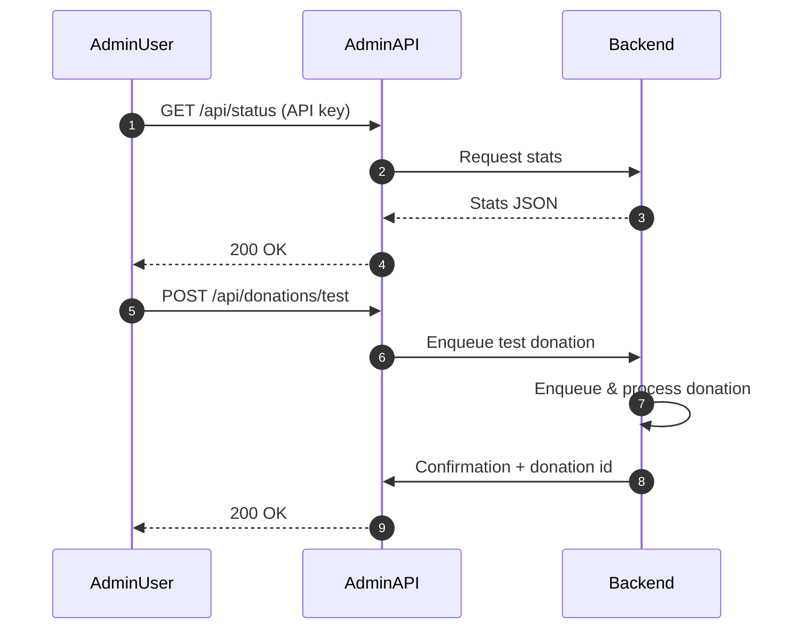

```mermaid
sequenceDiagram
    autonumber
    actor Viewer
    participant StreamPlatform
    participant Backend
    participant GameClient
    participant Overlay

    Viewer->>StreamPlatform: Donate (amount, viewer)
    StreamPlatform->>Backend: Deliver donation event
    Backend->>Backend: Rate-limit & enqueue donation
    Backend->>GameClient: Broadcast donation_event (WebSocket)
    Backend->>Overlay: Broadcast donation_alert (WebSocket/HTTP)
    GameClient->>GameClient: Apply effect (BOOST / SPAWN / HEAL)
    GameClient->>Backend: Send game_state_update
    Backend->>Overlay: Push overlay.update
    Overlay-->>Viewer: Display alert + updated HUD
```

```mermaid
sequenceDiagram
    autonumber
    participant AdminUser
    participant AdminAPI
    participant Backend

    AdminUser->>AdminAPI: GET /api/status (API key)
    AdminAPI->>Backend: Request stats
    Backend-->>AdminAPI: Stats JSON
    AdminAPI-->>AdminUser: 200 OK
    AdminUser->>AdminAPI: POST /api/donations/test
    AdminAPI->>Backend: Enqueue test donation
    Backend->>Backend: Enqueue & process donation
    Backend->>AdminAPI: Confirmation + donation id
    AdminAPI-->>AdminUser: 200 OK
```